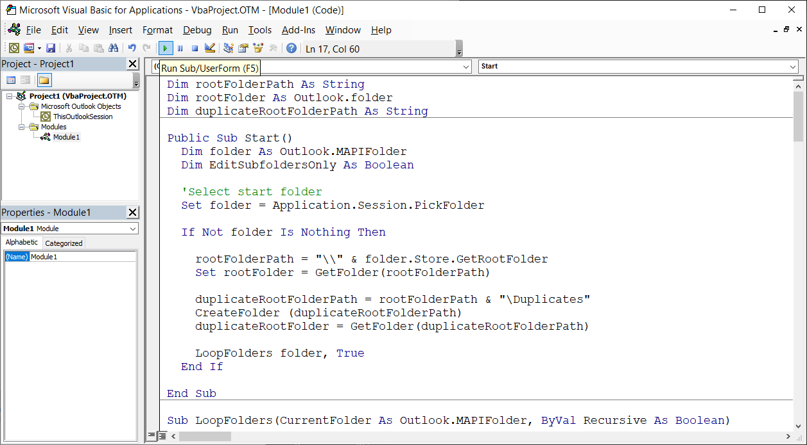
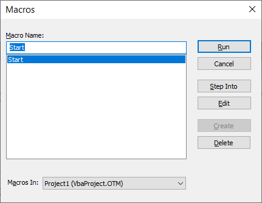
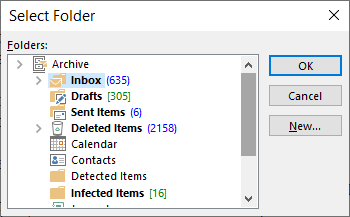

# Outlook Duplicated Items Remover

This script finds and moves duplicated items in selected outlook folders

## How to Use

* Paste the content of `main.bas` into  Outlook's VBA editor (See [this general guide](https://www.slipstick.com/developer/how-to-use-outlooks-vba-editor/) and skip the sign stages)
* Run the macro and select the folder you'd like to process
* The script will find duplicated items in the selected folder and all sub-folders
* The GUI may freeze while the script is running
* All duplicated items are moved to a dedicated "Duplicates" folder

## Screenshots

### Running the script

